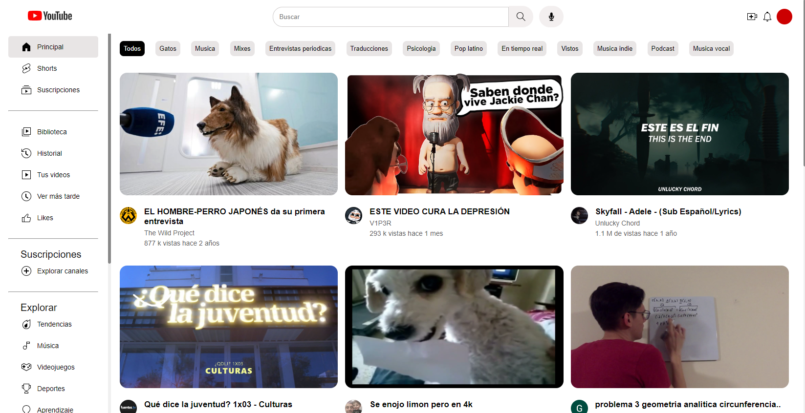
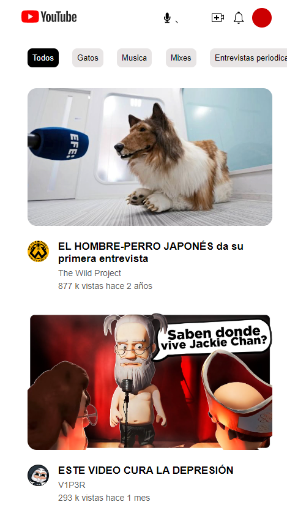

# Youtube Clon de Estilos
Este proyecto es una recreación del estilo frontend de la página principal de YouTube. Se ha desarrollado exclusivamente para imitar visualmente la página original, utilizando colores, tipografía, elementos e iconos inspirados directamente en la aplicación original. El objetivo principal es capturar la esencia estética y la familiaridad del diseño de YouTube, ofreciendo una experiencia visual auténtica para los usuarios.
## 💻 Tecnologias:
- Css
- Html
No tiene ninguna funcionabilidad es solo elementos y estilos.
## 🖼 interfaz y Responsive:
- **Pantallas grandes:**

- **Pantallas convencional:**

- **Movil:**

